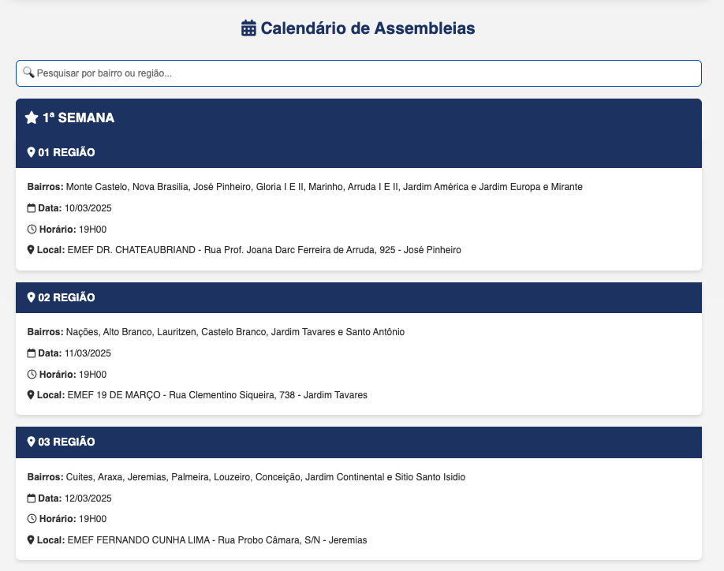
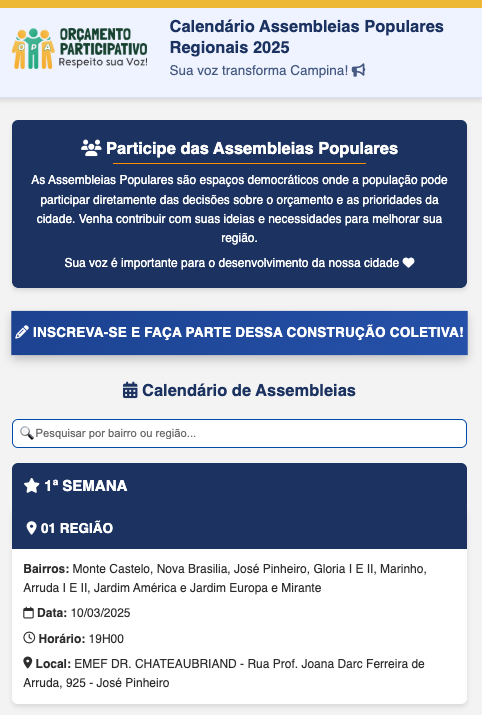
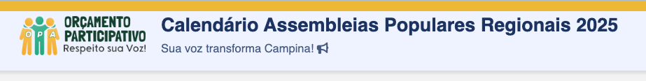

# Calendário Assembleias Populares Regionais 2025

Este projeto consiste em uma página web responsiva para exibir o calendário das Assembleias Populares Regionais de 2025, seguindo as melhores práticas de desenvolvimento web.

## Características

- Design responsivo que se adapta a diferentes tamanhos de tela
- Acessibilidade implementada seguindo as diretrizes WCAG
- Otimização de performance com lazy loading de imagens
- Funcionalidade de pesquisa por bairro ou região
- Animações suaves com suporte a preferências de redução de movimento
- Estrutura semântica HTML5
- Estilização moderna com CSS3 e variáveis CSS
- Interatividade com JavaScript puro

## Screenshots

### Cabeçalho e Seção Principal

*Design moderno com cabeçalho em azul, barra superior amarela e logo da prefeitura. A seção principal apresenta um título destacado e uma descrição clara do propósito das Assembleias Populares.*

### Calendário de Assembleias

*Organização clara das assembleias por região, com cards interativos que mostram informações detalhadas sobre bairros, datas, horários e locais de cada assembleia.*

### Versão Mobile

*Layout responsivo otimizado para dispositivos móveis, mantendo a legibilidade e usabilidade em telas menores.*

### Rodapé

*Rodapé com logo da cidade e informações de copyright, mantendo a identidade visual do site.*

## Estrutura do Projeto

```
.
├── index.html          # Arquivo HTML principal
├── styles.css          # Estilos CSS
├── script.js           # Funcionalidades JavaScript
├── images/             # Pasta com imagens do site
│   ├── logo-wide.png
│   ├── logo-square.png
│   ├── campina_branco2.png
│   ├── 1.jpeg
│   ├── 2.jpeg
│   ├── 3.jpeg
│   └── 1.png
└── README.md           # Documentação do projeto
```

## Tecnologias Utilizadas

- HTML5 semântico
- CSS3 com variáveis e media queries
- JavaScript ES6+
- Intersection Observer API para lazy loading
- Fontes web otimizadas (Google Fonts)

## Práticas Implementadas

1. **Progressive Enhancement**: A página funciona mesmo sem JavaScript habilitado.
2. **Otimização de Critical Rendering Path**: CSS crítico inline e carregamento assíncrono de recursos.
3. **Acessibilidade**: Uso de HTML semântico, contraste adequado, suporte a prefers-reduced-motion.
4. **Responsividade**: Design adaptável a diferentes dispositivos usando media queries.
5. **Lazy Loading**: Carregamento sob demanda de imagens para melhorar performance.
6. **Animações Otimizadas**: Animações suaves com fallback para usuários que preferem movimento reduzido.

## Como Usar

1. Clone o repositório
2. Abra o arquivo `index.html` em um navegador web moderno
3. Alternativamente, hospede os arquivos em um servidor web

## Melhorias Futuras

- Implementação de Service Workers para funcionalidade offline
- Adição de mais recursos de acessibilidade
- Otimização adicional de imagens
- Implementação de PWA (Progressive Web App)

## Licença

Este projeto está sob a licença MIT. Veja o arquivo LICENSE para mais detalhes. 